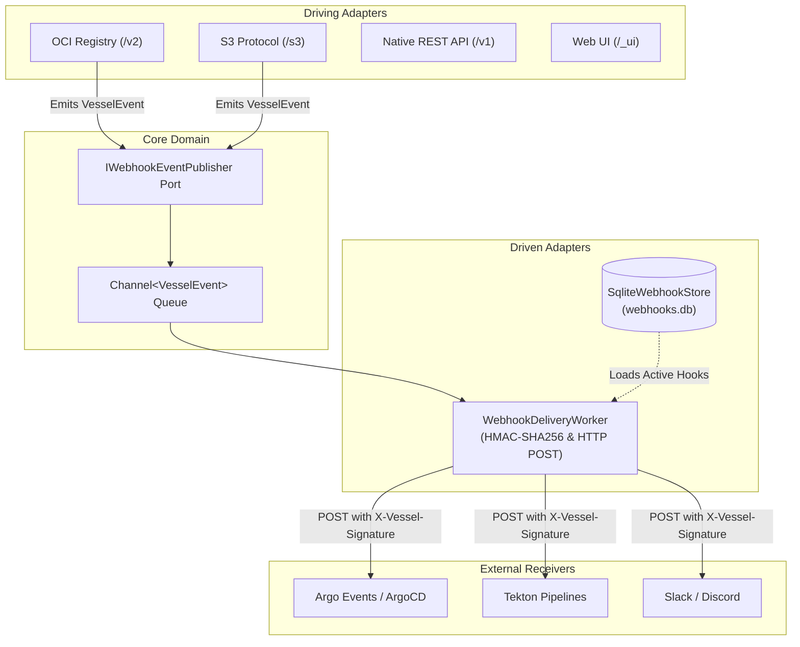

# Webhooks & Event Notifications

Vessel3 features a system-wide, high-throughput event notification subsystem built on a hexagonal architecture (Ports & Adapters). When resources change—such as an OCI container image being pushed or an S3 object being uploaded—Vessel3 emits strongly-typed domain events to an in-process, non-blocking delivery queue.

Webhooks can be declared **statically in YAML** (`webhooks.yaml`), managed **dynamically in the Web UI**, configured via the **Native REST API** (`/v1/webhooks`), or provisioned declaratively in Kubernetes via the **Vessel3 Operator** (`VesselWebhook`).

---

## Architecture: Ports & Adapters



### Key Characteristics
- **Zero Ingestion Latency**: Uploads (`docker push`, S3 `PutObject`) complete immediately. Webhook dispatch occurs asynchronously on a background `Channel<VesselEvent>`.
- **Cryptographic Signatures**: Webhooks with configured secrets are signed with HMAC-SHA256 via the `X-Vessel-Signature` HTTP header.
- **Topic & Resource Filtering**: Webhooks can subscribe to granular event topics (e.g. `container.image.pushed`) and restrict deliveries to specific resource patterns (e.g. `drummer:*` or `rainier/*`).
- **Telemetry & Health**: Every delivery attempt records latency, timestamp, status code, and any error message directly in the webhook store for observability in the Web UI and Kubernetes status.

---

## Event Topics & Taxonomy

Vessel3 organizes events into hierarchical dot-separated topics. Webhook filters support exact matching and glob wildcards (`*`).

| Event Topic | Description | Resource Example | Properties Payload |
|---|---|---|---|
| `container.image.pushed` | Emitted when an OCI container manifest or image tag is uploaded | `drummer:latest`<br>`rainier/app:v1.2.0` | `digest`, `mediaType`, `size`, `tag` |
| `container.image.deleted` | Emitted when a container tag or manifest is removed | `drummer:latest` | `digest` |
| `s3.object.created` | Emitted when an S3 object is created or overwritten | `backups/db.tar.gz` | `size`, `eTag`, `versionId` |
| `s3.object.deleted` | Emitted when an S3 object is deleted or delete marker placed | `backups/db.tar.gz` | `versionId`, `deleteMarker` |

### Topic Wildcards
- `*`: Matches every event emitted across the entire system.
- `container.*`: Matches all container repository events (`container.image.pushed`, `container.image.deleted`).
- `s3.*`: Matches all object storage lifecycle events (`s3.object.created`, `s3.object.deleted`).

---

## Resource Filters

Webhooks can restrict delivery to matching resource identifiers using exact names or glob wildcards:

- `*` or empty/null: Matches all resources unconditionally.
- `drummer:*`: Matches any tag in the `drummer` repository (e.g., `drummer:latest`, `drummer:v1.0.0`).
- `rainier/*`: Matches any image under the `rainier` namespace or objects in the `rainier` bucket.
- `avasarala:production`: Matches only the exact image tag `avasarala:production`.

---

## Webhook Delivery Payload & Security

### HTTP Headers

Every webhook POST includes the following headers:

| Header | Description | Example |
|---|---|---|
| `Content-Type` | MIME type | `application/json; charset=utf-8` |
| `User-Agent` | Vessel3 client signature | `Vessel3-Webhook-Delivery/1.0` |
| `X-Vessel-Delivery` | Unique delivery UUID | `d550e840-0c9a-4c28-bb8c-8cf2f01f7871` |
| `X-Vessel-Event` | Event topic string | `container.image.pushed` |
| `X-Vessel-Signature` | HMAC-SHA256 signature (*present when secret is configured*) | `sha256=5f3...` |

### JSON Payload Schema

```json
{
  "id": "evt_01J8R6T3Y9K20",
  "type": "container.image.pushed",
  "resource": "drummer:v2.1.0",
  "timestamp": "2026-10-03T12:00:00.0000000Z",
  "actor": "avasarala",
  "properties": {
    "digest": "sha256:7c9e782987a0279d5e3ef54deca67e5e34be64fa",
    "mediaType": "application/vnd.oci.image.manifest.v1+json",
    "size": "4096",
    "tag": "v2.1.0"
  },
  "host": "vessel.local:9000"
}
```

### Verifying HMAC Signatures (Python Example)

```python
import hmac
import hashlib

def verify_vessel_webhook(payload_bytes: bytes, secret: str, signature_header: str) -> bool:
    if not signature_header or not signature_header.startswith("sha256="):
        return False
    expected_sig = signature_header[len("sha256="):]
    computed_sig = hmac.new(secret.encode("utf-8"), payload_bytes, hashlib.sha256).hexdigest()
    return hmac.compare_digest(expected_sig, computed_sig)
```

---

## Configuration Methods

### 1. Declarative YAML (`webhooks.yaml`)

For GitOps, Kubernetes volumes, or infrastructure-as-code, webhooks can be declared in `webhooks.yaml` in the data directory (or specified via `VESSEL3_WEBHOOKS_FILE`).

Webhooks loaded from YAML are marked **Static**: they cannot be deleted or mutated via the Web UI or REST API, preventing configuration drift.

```yaml
webhooks:
  - id: ci-deploy
    name: "ArgoCD Auto Sync"
    url: "https://argo.example.com/api/v1/events"
    secret: "rainier-signing-secret"
    events:
      - container.image.pushed
    resources:
      - drummer:*
      - rainier/*
    active: true

  - id: slack-notifications
    name: "Slack Alert on Deletion"
    url: "https://hooks.slack.com/services/T00/B00/X00"
    events:
      - container.image.deleted
      - s3.object.deleted
    active: true
```

### 2. Web UI (`/_ui/#webhooks`)

The embedded administrative dashboard provides full webhook management:
1. Navigate to **System > Webhooks** in the sidebar.
2. View registered webhooks with status indicators, event badges, and delivery health (last status code, latency, and errors).
3. Click **New Webhook** to dynamically configure endpoints, event filters, resource patterns, and secrets.
4. Click **Test** to dispatch a mock `vessel.ping` event and verify endpoint connectivity with live latency and HTTP response reporting.
5. Click **Export YAML** to copy the current configuration for GitOps repositories.

### 3. Kubernetes Custom Resource (`VesselWebhook`)

When using the `vessel3-operator`, webhooks can be declared as first-class Kubernetes resources:

```yaml
apiVersion: vessel.nechja.io/v1alpha1
kind: VesselWebhook
metadata:
  name: container-push-notifier
  namespace: default
spec:
  serverRef:
    name: vessel-primary
  name: "ArgoCD Webhook"
  url: "https://argo-events.pipeline.svc.cluster.local:12000/vessel"
  secretRef:
    name: webhook-signing-secret
    key: secret-token
  eventFilters:
    - "container.image.pushed"
  resourceFilters:
    - "drummer:*"
  active: true
```

---

## Native REST API (`/v1/webhooks`)

### List Webhooks
```http
GET /v1/webhooks
Authorization: Bearer <token>
```
**Response: `200 OK`**
```json
[
  {
    "id": "whk_01J8R6T3Y9",
    "name": "CI Deploy",
    "url": "https://ci.example.com/hooks",
    "secret": "rainier-secret",
    "eventFilters": ["container.image.pushed"],
    "resourceFilters": ["drummer:*"],
    "active": true,
    "createdAt": "2026-10-03T12:00:00Z",
    "lastTriggeredAt": "2026-10-03T12:05:00Z",
    "lastStatusCode": 200,
    "lastError": null,
    "isStatic": false
  }
]
```

### Create Webhook
```http
POST /v1/webhooks
Content-Type: application/json
Authorization: Bearer <token>

{
  "name": "Production Push Alert",
  "url": "https://events.example.com/vessel",
  "secret": "hood-secret",
  "eventFilters": ["container.image.pushed"],
  "resourceFilters": ["drummer:*"],
  "active": true
}
```
**Response: `201 Created`**

### Update Webhook
```http
PUT /v1/webhooks/{id}
Content-Type: application/json
Authorization: Bearer <token>

{
  "name": "Production Push Alert",
  "url": "https://events.example.com/vessel-updated",
  "secret": "hood-secret",
  "eventFilters": ["container.*"],
  "resourceFilters": ["*"],
  "active": true
}
```
**Response: `200 OK`**

### Delete Webhook
```http
DELETE /v1/webhooks/{id}
Authorization: Bearer <token>
```
*Note: Returns `400 Bad Request` if attempting to delete a static webhook loaded from `webhooks.yaml`.*

**Response: `204 No Content`**

### Test Webhook (Ping)
```http
POST /v1/webhooks/{id}/test
Authorization: Bearer <token>
```
**Response: `200 OK`**
```json
{
  "webhookId": "whk_01J8R6T3Y9",
  "success": true,
  "statusCode": 200,
  "latencyMs": 42.5,
  "errorMessage": null,
  "responseBody": "OK"
}
```

### Export Active Webhooks as YAML
```http
GET /v1/webhooks/export.yaml
Authorization: Bearer <token>
```
**Response: `200 OK` (`text/yaml; charset=utf-8`)**

---

## C# .NET Client SDK (`IVesselClient`)

The `Vessel3.Client` package provides strongly-typed methods for webhook management:

```csharp
using Vessel3.Client;

using var client = new VesselClient("http://127.0.0.1:9000", "access-key", "secret-key");

// 1. Create a webhook
var createResult = await client.CreateWebhookAsync(new CreateWebhookDto(
    Name: "ArgoCD Auto Sync",
    Url: "https://argo.example.com/events",
    Secret: "rainier-secret",
    EventFilters: ["container.image.pushed"],
    ResourceFilters: ["drummer:*"],
    Active: true));

if (createResult.TryGetValue(out var webhook, out var err))
{
    Console.WriteLine($"Created webhook: {webhook.Id}");
}

// 2. Test ping the webhook
var testResult = await client.TestWebhookAsync(webhook.Id);
if (testResult.TryGetValue(out var test, out _))
{
    Console.WriteLine($"Test result: {test.StatusCode} in {test.LatencyMs}ms");
}

// 3. Export active webhooks as YAML
var yamlResult = await client.ExportWebhooksYamlAsync();
if (yamlResult.TryGetValue(out var yaml, out _))
{
    Console.WriteLine(yaml);
}
```
